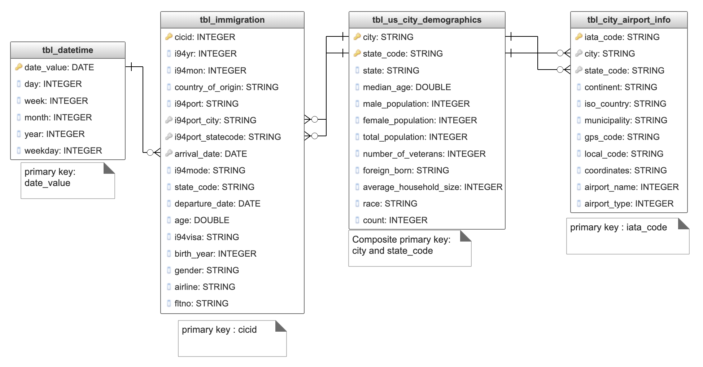

# Project Title : Analyze Immigrant Data by City in US.
### Data Engineering Capstone Project

#### Project Summary
Each year various travelers from various countries in the world visit US. Travelers often enter US via airports, based on a specific visa type. This project  refers to Immigration Data, Airport Data, Demographic Data and   provides an analysis about:
* a. travelers who arrive at various city airports and city specific demographics.
* b. provides no of travelers arriving per city per month
* c. provides no of travelers per country of origin per month
* d. provides no of traverlers per visa type

Based on above analytics, there are business opportunities like:
* a. Airlines can make a business decision to arrange more flights in specific routes(countries)
* b. Local/International travel agencies can provide more tourism packages
* c. US Immigration Agency can provide more services for various visa types
* d. Local city population info would help internation travelers to decide on destination they would like to visit.

### Step 1: Scope the Project and Gather Data

#### Scope 
Refer to the data sources for immigration, airport_codes, US demographics data. Generate some sort of analytics which provides information about immigrant visitors entered US , through city airports. Provide some demographics as well for the city.

Since the datasets are open ended, do thorough analysis and use necessary external data sources, look for forming proper data relation.Since the provded raw data sources are not clean, external data sources are referred.
After getting the relationship between the Dataset, design data models, building the data pipelines in Data Lakes for creating the data models, check Data Quality, write SQL queries to answer questions and write summary docs.

Components used in this project:
1. Data Source and Target uses local storage as Object Storage. AWS S3 can be used, but its taking more run time. Hence used local storage.
2. Used Python programming language and Spark framework to build an ETL pipeline

#### Describe and Gather Data 
The data sets that have been used in the project are listed below:

1. I94 Immigration Data: This data comes from the US National Tourism and Trade Office. You can read more about it [here](https://travel.trade.gov/research/reports/i94/historical/2016.html). Data on individual travel to the U.S. for the year 2016. The data is stored in separate 'sas7bdat' files for 1 month each.
2. Airport & IATA Codes: A csv files is provided with airport codes.  Since the data is not clean, external dataset called "US_iata_codes.csv" is used. The original source of this iata_codes is [here](https://www.iata.org/en/publications/store/airline-coding-directory/ 
https://docs.google.com/spreadsheets/d/1eepIWOHicQsLyZsb0mSXGPTXDp3vlql-aGuy1AWJED0/edit#gid=863195591) 
3. U.S. City Demographic Data: This data comes from OpenSoft. You can read more about it [here](https://public.opendatasoft.com/explore/dataset/us-cities-demographics/export/). This dataset contains information about the demographics of all US cities and census-designated places with a population greater or equal to 65,000. This dataset is stored as a 'csv' file.

> Note: Since the there is no direct relation between immigration data and airport codes, external sources are referred. Data is filtered and prepared to build a relation between I94 immigration data, airports, US City Demographics

### Step 2: Explore and Assess the Data
1. Raw data is explored as per the source files provided and accumulated as needed
2. Data is loaded into staging Dataframes and essential filters are applie to remove invalid and duplicates
3. Each function insilde et.py has essential logic for ensuring the data quality

### Step 3: Define the Data Model
#### 3.1 Conceptual Data Model
Map out the conceptual data model and explain why you chose that model:

Based on the final purpose of analytics data to be obtained ,intent is to explore the immigraton data by city and to provide the traveler patterns by visa type, country of origin etc.

Four tables are to be created with appropriate columns and by reading data sources immigration data, airport_codes, US city Demographics.
The data schema referred here is a Relational Schema. Below mentioned Four tables are created with specific columns and relations between the tables.
Advantage of Relational Schema: Since the source datasets are open ended, appropriate fields from each source are considered in order to achieve the specified requirement. If any additional data sources are to be considered to retreive extra data for analytics, it would be easy to map the data based on city, state, iata_code etc.

With more specific assumptions and rules , there is a possibility to generate more precise data. This can be further used to create a star schema model as well. But this might reduce the data quantity and might not be helpful to have good enough amount of analytics. 
 
    
    a.tbl_immigration: Data is read from sas files path and then apply appropraite filters,cleaning to the dataset. Then generate final table by selecting specific columns. A parquet format table is created in local storage path.

    b.tbl_city_airport_info: Data is read from airport_codes csv and US_iata_codes csv files. Appropriate columns are selected to generate final table. A parquet format table is created in local storage path.

    c.tbl_us_city_demographics: Data is read from us_city_demographics csv file. Appropriate columns are selected to generate final table. A parquet format table is created in local storage path
    
    d.tbl_datetime: This is a Dimension table which contains all date and time related columns.Referrence date value is obtained from arrival_date of tbl_immigration.Rest of the columns are generated using prebuilt functions.  A parquet format table is created in local storage path

 

tbl_immigration:
*  cicid (Primary key): integer ==> unique number for immigrant
*  i94yr: integer ==>  year
*  i94mon: integer ==> month
*  country_of_origin: string ==> citizenship of immigrant
*  i94port: string ==>  port of entry city, state
*  i94port_city: string ==> City
*  i94port_statecode: string ==> State
*  arrival_date: date ==> arrival date of immigrant
*  i94mode: string ==> Travel by air,land, sea
*  state_code: string ==> State Code 
*  departure_date: date ==> departure date of immigrant
*  age: double ==> age of immigrant 
*  i94visa: string ==> visa type(Business,Pleasure, Student)
*  birth_year: integer ==> year of birth for immigrant
*  gender: string ==>gender (male or female)
*  airline: string ==> traveler airline info
*  fltno: string ==> traveler flight no

tbl_city_airport_info:
 *  iata_code (Primary key): string ==> iata code for the airport
 *  city: string ==> City
 *  state_code: string ==>state code
 *  continent: string ==> continent 
 *  iso_country: string ==> country 
 *  iso_region: string ==> state
 *  municipality: string ==> municipality airport belongs to 
 *  gps_code: string ==> gps code of the airport
 *  local_code: string ==> local airport code
 *  coordinates: string ==> geographical coordinates
 *  airport_name: string ==> Name of the airport
 *  airport_type: string ==> type of airport(large,medium closed etc.)

tbl_us_city_demographics:
Please nore columns city & state_code are used to form a composite primary key
 *  city(Primary key): string ==> city name
 *  state_code (Primary key): string ==> state code
 *  state: string ==> complete state name
 *  median_age: string ==> median age of population in city
 *  male_population: integer ==> No of male population in city
 *  female_population: integer ==> No of female population in city
 *  total_population: integer ==> Total population in city
 *  number_of_veterans: integer  ==> No of veterans in city
 *  foreign_born: string ==> No of Foreign born in city
 *  average_household_size: double ==> Average household size in city 
 *  race: string ==> race types living in city
 *  count: integer ==> count of race type people

tbl_datetime:
*  date_value (Primary key): date ==> arrival/departure date value from immigration
 *  day: integer ==> day no of the year
 *  week: integer ==> week no of the year
 *  month: integer ==> month no of the year
 *  year: integer ==> year value
 *  weekday: integer ==> weekday no

The conceptual data model is designed as following:
Data Model diagram:

#### 3.2 Mapping Out Data Pipelines
List the steps necessary to pipeline the data (Data Lakes) into the chosen data model:

1. Data Sources are prepared and uploaded to local storage. 
2. Download SAS immigration date files and save in local storage
3. Explore I94_SAS_Labels_Description file and create explicit csv files
    a. I94_state_code_name.csv : This contains I94ADDR mapping info
    b. I94_country_code_name.csv : This contains I94CIT_I94RES mapping info
    c. I94_mode.csv : This contains I94MODE mapping info
    d. I94_port_city.csv: This contains I94PORT mapping info
    e. I94_visa_type.csv : This contains I94VISA mapping info
3. Run ETL process to read data and generate tables (save tables in form of parquet files)
4. Execute Analytics process related query as needed

### Step 4: Run Pipelines to Model the Data 
#### 4.1 Create the data model by running python scripts
1. Run download_sas_data.py to download immigration data
    command : python3 download_sas_data.py
2. Run etl.py to read data from sources and generate tables
    command : python3 etl.py
3. Run data_quality_checks.py to verify the quality of data
    command python3 data_quality_checks.py
4. Run analytics.py to explore the immigration data by city
    command: python3 analytics.py

#### 4.2 row counts in tables
"tbl_immigration_data" table have 40790529 records                                                                                      

“tbl”_city_airport_info table have 424 records

“tbl_us_city_demographics" table have 2875 records                                                                              

“tbl_datetime” table have 235 records        

#### Clearly state the rationale for the choice of tools and technologies for the project.

1. Python programming language along with implicit libraries to read data and write data
2. Used Spark framework as processing engine for running the logical process
3. Used Local storage for source files and to save the files in parquet format
4. S3 can be used as well for storage and its takeing more processing run time.

#### Propose how often the data should be updated and why.
Based on understanding of the data, a weekly/monthly refresh would give us good enough insights into immigration data.
Probably expand the sources and gather more information to have more explorative options.

#### Write a description of how you would approach the problem differently under the following scenarios:
 The data was increased by 100x.
1. More infrastructure with scalable options. Compute and storage to handle more data volumes
2. Possible options could be 
    a. AWR EMR Cluster and S3 for storage
    b. Azure HDInsight Cluster and ADLSGen2 for storage
3. Essential data cleansing and filters should be in place to avoid usage of invalid data.

#### The data populates a dashboard that must be updated on a daily basis by 7am every day.
1. Create the necessary scripts which would read, clean and save the data from given set of sources
2. Use a scheduler (like Jenkins) to run the scripts based on daily schedule
3. Create data quality check scripts to ensure refreshed data is valid and ready to be used

#### The database needed to be accessed by 100+ people.
1. Consider using some data storage like AWS Redshift, Azure Cosmos 
2. Create tables as per the Data Model obtained
3. Run the etl process to populate the date into tables defined
4. Create Access Groups to connect and read the data
5. Add End users to the Access Groups.
6. Ensure to confgiure enough compute capacity for Data storage engines to allow 100+ users concurrently.
